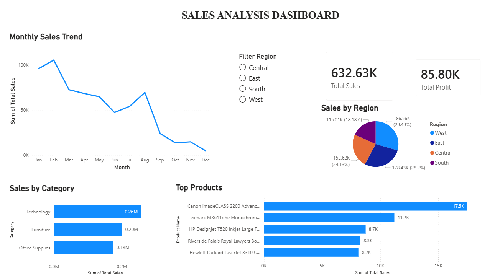

# Sales Analysis Dashboard 📊

## 📌 Project Overview
This project analyzes sales data to identify trends, top-performing categories, and business insights using Python, SQL, and Power BI.

## 🛠️ Tools Used
- Python (Pandas, Matplotlib, Seaborn)
- SQL
- Power BI

## 📂 Files Included
- sales_data_analysis.ipynb → Data analysis using Python
- analysis_queries.sql → SQL queries
- sales_analysis.pbix → Power BI dashboard
- superstore.csv → Dataset
- sales_analysis_dashboard.png → Dashboard preview
  
## 📊 Key Insights
- Technology category has highest sales
- Monthly sales show fluctuating trend
- West region contributes significantly
- Top products identified based on sales

## 📸 Dashboard Preview

## 🚀 Conclusion
This project demonstrates end-to-end data analysis from raw data to visualization and insights.
